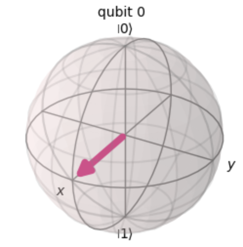
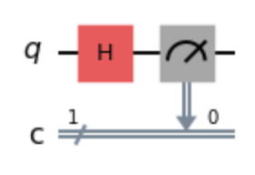

# Quantum Computing with Python

In this repo you can find useful examples of Qunatum Mechanics simulations.\
All the projects are documented on [*Medium*](https://maurodp.medium.com/) and [*TowardsDataScience*](https://towardsdatascience.com/author/maurodp/)
 
 
• Qubits

• Circuits

