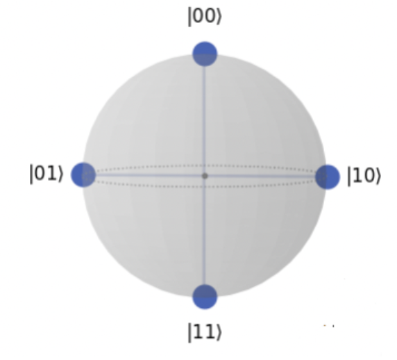

# Quantum Computing with Python

In this repo you can find useful examples of Quantum Mechanics and Quantum Machine Algorithms.

 

- <ins>**[Quantum Mechanics](https://github.com/mdipietro09/QuantumComputing_Utils/blob/master/example_quantum_mechanics.ipynb)**</ins>

	* Qubits and Circuits

		

 

- <ins>**[Quantum Algorithms](https://github.com/mdipietro09/QuantumComputing_Utils/blob/master/example_quantum_algorithms.ipynb)**</ins>

	* Cybersecurity

		

 

- <ins>**[Quantum Machine Learning](https://github.com/mdipietro09/QuantumComputing_Utils/blob/master/example_quantum_ml.ipynb)**</ins>

	* Classification and Regression

		
